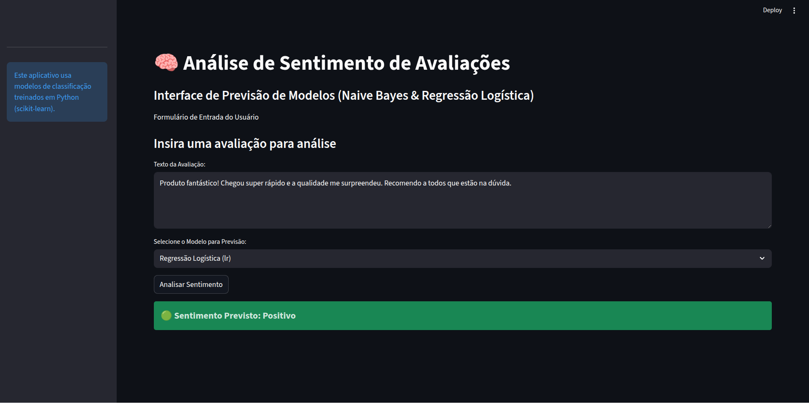

# Análise de Sentimentos sob Incerteza

> Inferência probabilística e aprendizado supervisionado aplicados a avaliações online

[](https://www.python.org/)
[](https://scikit-learn.org/)
[](https://streamlit.io/)

## 📋 Sumário

- [Visão Geral](#🎯-visão-geral)
- [Problema](#🔍-problema)
- [Abordagem Técnica](#🧠-abordagem-técnica)
- [Arquitetura do Sistema](#🏗️-arquitetura-do-sistema)
- [Estrutura do Projeto](#📁-estrutura-do-projeto)
- [Requisitos](#📦-requisitos)
- [Instalação e Configuração](#🚀-instalação-e-configuração)
- [Execução](#▶️-execução)
- [Pipeline de Desenvolvimento](#🔄-pipeline-de-desenvolvimento)
- [Modelos Implementados](#🤖-modelos-implementados)
- [Resultados](#📊-resultados)
- [Tecnologias Utilizadas](#🛠️-tecnologias-utilizadas)
- [Autores](#👥-autores)

## 🎯 Visão Geral
Este projeto implementa um sistema de **análise automática de sentimentos** em avaliações de produtos escritas em português brasileiro. Utilizando técnicas de **Processamento de Linguagem Natural (PLN)** e **aprendizado supervisionado probabilístico**, o sistema classifica o sentimento de uma avaliação como **positivo**, **neutro** ou **negativo**.


*Figura: Interface web do sistema de análise de sentimentos desenvolvida com Streamlit*

O projeto aplica conceitos fundamentais de Inteligência Artificial, incluindo:
- Raciocínio probabilístico (Teorema de Bayes)
- Inferência em ambientes com incerteza
- Aprendizado supervisionado
- Agentes inteligentes baseados em percepção e ação

## 🔍 Problema

O consumidor moderno enfrenta uma **paralisia de decisão** ao tentar avaliar produtos online: com centenas de avaliações disponíveis, a leitura manual de todos os comentários é impraticável e ineficiente. Além disso, existe o desafio de separar o "sinal" (opiniões genuínas sobre o produto) do "ruído" (reclamações sobre entrega, comentários irrelevantes ou falsos).

Do ponto de vista acadêmico, este é um **problema de inferência em ambientes com incerteza**:
- O sentimento é um **estado não observável** (variável latente)
- Deve ser **inferido** a partir de dados textuais ambíguos
- Requer modelagem probabilística para lidar com incerteza linguística

## 🧠 Abordagem Técnica

### Modelagem como Agente Probabilístico

O sistema é estruturado como um **agente probabilístico** que utiliza raciocínio bayesiano:

1. **Percepção**: O agente recebe o texto da avaliação como entrada
2. **Atualização de Crenças**: Calcula probabilidades com base em evidências textuais (palavras/n-gramas)
3. **Ação**: Classifica o sentimento com base nas probabilidades inferidas

### Fundamentos Matemáticos

O modelo Naive Bayes aplica o **Teorema de Bayes** para inferência:

$$P(\text{sentimento} \mid \text{texto}) = \frac{P(\text{texto} \mid \text{sentimento}) \cdot P(\text{sentimento})}{P(\text{texto})}$$

Assumindo independência condicional entre as palavras (suposição "naive"):

$$P(\text{texto} \mid \text{sentimento}) = \prod_{i=1}^{n} P(w_i \mid \text{sentimento})$$

## 🏗️ Arquitetura do Sistema

```
┌─────────────────────────────────────────────────────────────┐
│                     Interface Web (Streamlit)               │
│  ┌─────────────────────────────────────────────────────┐    │
│  │  Entrada: Texto da Avaliação                        │    │ 
│  │  Seleção: Modelo (Naive Bayes / Regressão Logística)│    │
│  └─────────────────────────────────────────────────────┘    │
└───────────────────────────┬─────────────────────────────────┘
                            │
                            ▼
┌─────────────────────────────────────────────────────────────┐
│              API de Predição (prediction_api.py)            │
│  ┌─────────────────────────────────────────────────────┐    │
│  │  1. Carrega modelo e vetorizador (cache)            │    │
│  │  2. Limpa e normaliza texto                         │    │
│  │  3. Vetoriza com TF-IDF                             │    │
│  │  4. Realiza inferência                              │    │
│  └─────────────────────────────────────────────────────┘    │
└───────────────────────────┬─────────────────────────────────┘
                            │
                            ▼
┌─────────────────────────────────────────────────────────────┐
│                    Modelos Persistidos                      │
│  ┌──────────────────┐  ┌──────────────────┐  ┌──────────┐   │
│  │ Naive Bayes      │  │ Reg. Logística   │  │ TF-IDF   │   │
│  │ (.joblib)        │  │ (.joblib)        │  │ (.joblib)│   │
│  └──────────────────┘  └──────────────────┘  └──────────┘   │
└─────────────────────────────────────────────────────────────┘
```

## 📁 Estrutura do Projeto

```
sentimento-de-avaliacoes/
│
├── app.py                          # Interface Streamlit (ponto de entrada)
├── requirements.txt                # Dependências Python
├── README.md                       # Documentação do projeto
│
├── dataset/
│   └── avaliacoes.csv              # Dataset de avaliações rotuladas
│
├── models/
│   ├── nb_modelo_sentimento.joblib # Modelo Naive Bayes treinado
│   ├── lr_modelo_sentimento.joblib # Modelo Regressão Logística treinado
│   └── vetorizador_tfidf.joblib    # Vetorizador TF-IDF treinado
│
├── docs/
│   └── image.png                   # Screenshot da interface
│
└── src/
    ├── __init__.py
    ├── dataset_generator.py        # Geração de dataset sintético (Gemini API)
    ├── data_preprocessing.py       # Limpeza e vetorização de texto
    ├── model_training.py           # Treinamento e avaliação dos modelos
    ├── model_persistence.py        # Salvamento e carregamento de modelos
    ├── prediction_api.py           # API de inferência
    └── pipeline.py                 # Pipeline completo de treinamento
```

## 📦 Requisitos

### Dependências Python

- `python >= 3.8`
- `google-generativeai` - Geração de dataset sintético
- `pandas` - Manipulação de dados
- `python-dotenv` - Gerenciamento de variáveis de ambiente
- `nltk` - Processamento de linguagem natural
- `scikit-learn` - Modelos de machine learning
- `seaborn` / `matplotlib` - Visualização de resultados
- `joblib` - Persistência de modelos
- `streamlit` - Interface web

Todas as dependências estão listadas em `requirements.txt`.

### Variáveis de Ambiente (Opcional)

Para gerar um **novo dataset**, é necessário configurar a API Key do Google Gemini:

```bash
# .env
GEMINI_API_KEY=sua_chave_aqui
```

> ⚠️ **Nota**: A API Key só é necessária para geração de novos datasets. O projeto já inclui um dataset pré-gerado em `dataset/avaliacoes.csv`.

## 🚀 Instalação e Configuração

### 1. Clone o Repositório

```bash
git clone <url-do-repositorio>
cd sentimento-de-avaliacoes
```

### 2. Crie um Ambiente Virtual

```bash
python -m venv .venv
source .venv/bin/activate  # Linux/macOS
# ou
.venv\Scripts\activate     # Windows
```

### 3. Instale as Dependências

```bash
pip install -r requirements.txt
```

### 4. (Opcional) Configure a API Key do Gemini

Se desejar gerar um novo dataset:

```bash
# Crie um arquivo .env na raiz do projeto
echo "GEMINI_API_KEY=sua_chave_aqui" > .env
```

Para obter a chave, acesse [Google AI Studio](https://aistudio.google.com/app/apikey).

## ▶️ Execução

### Opção 1: Usar Modelos Pré-treinados (Recomendado)

Se  já contém os modelos treinados em `models/`, basta executar a interface:

```bash
streamlit run app.py
```

A aplicação estará disponível em `http://localhost:8501`.

### Opção 2: Retreinar os Modelos

Para retreinar os modelos do zero (com novo dataset ou parâmetros):

```bash
python -m src.pipeline
```

Isso executará o pipeline completo:
1. Geração/carregamento do dataset
2. Pré-processamento dos dados
3. Treinamento dos modelos
4. Avaliação e persistência

Após o treinamento, execute a interface:

```bash
streamlit run app.py
```

## 🔄 Pipeline de Desenvolvimento

O pipeline de machine learning é executado pelo módulo `src/pipeline.py` e consiste em 4 etapas:

### 1. Geração do Dataset (`dataset_generator.py`)

- Utiliza a **API Google Gemini** para gerar avaliações sintéticas em português brasileiro
- Gera 200 avaliações por classe (positivo, negativo, neutro)
- Total: **600 avaliações** rotuladas
- Simula avaliações reais de marketplaces (Amazon, Mercado Livre)

**Formato do dataset**:
```csv
avaliacao,sentimento
"Produto excelente, superou expectativas!",positivo
"Entrega demorou muito, produto OK.",neutro
"Péssima qualidade, não recomendo.",negativo
```

### 2. Pré-processamento dos Dados (`data_preprocessing.py`)

#### 2.1 Limpeza Textual
- Remoção de acentuação (normalização Unicode)
- Remoção de números e caracteres especiais
- Conversão para minúsculas
- Remoção de stopwords em português (NLTK)

**Exemplo**:
```
Original: "Ótimo produto! Recomendo 100%."
Limpo:    "otimo produto recomendo"
```

#### 2.2 Vetorização TF-IDF
- Converte texto em representação numérica
- Captura importância relativa das palavras
- Considera unigramas e bigramas (`ngram_range=(1,2)`)
- Filtra termos raros (`min_df=3`)

$$\text{TF-IDF}(t, d) = \text{TF}(t, d) \times \log\left(\frac{N}{\text{DF}(t)}\right)$$

Onde:
- $\text{TF}(t, d)$ = frequência do termo $t$ no documento $d$
- $N$ = número total de documentos
- $\text{DF}(t)$ = número de documentos contendo o termo $t$

#### 2.3 Divisão Train/Test
- 75% treino / 25% teste
- Estratificação por classe (mantém proporção de sentimentos)
- Seed fixo (`random_state=42`) para reprodutibilidade

### 3. Treinamento dos Modelos (`model_training.py`)

#### 3.1 Naive Bayes (MultinomialNB)

**Fundamento Teórico**:
- Baseado no Teorema de Bayes
- Assume independência condicional entre features (palavras)
- Adequado para dados de contagem (TF-IDF)

**Vantagens**:
- Eficiente computacionalmente
- Funciona bem com poucos dados
- Interpretabilidade (probabilidades explícitas)

#### 3.2 Regressão Logística

**Fundamento Teórico**:
- Modelo linear discriminativo
- Estima probabilidades via função sigmoide/softmax
- Otimização por máxima verossimilhança

**Função de decisão** (classe binária):

$$P(y=1 \mid x) = \frac{1}{1 + e^{-(\mathbf{w}^T\mathbf{x} + b)}}$$

**Vantagens**:
- Baseline forte para classificação de texto
- Regularização previne overfitting
- Coeficientes interpretáveis

### 4. Avaliação e Persistência (`model_persistence.py`)

#### Métricas de Avaliação

- **Acurácia**: Proporção de predições corretas
- **F1-Score** (weighted): Média harmônica entre precisão e recall, ponderada por classe
- **Matriz de Confusão**: Visualização de acertos/erros por classe
- **Classification Report**: Métricas detalhadas por classe

#### Persistência

Os modelos treinados são salvos usando `joblib`:
- `models/nb_modelo_sentimento.joblib`
- `models/lr_modelo_sentimento.joblib`
- `models/vetorizador_tfidf.joblib`

## 🤖 Modelos Implementados

### Naive Bayes (MultinomialNB)

```python
from sklearn.naive_bayes import MultinomialNB

nb_model = MultinomialNB()
nb_model.fit(X_train_tfidf, y_train)
```

**Hiperparâmetros**: Padrão (alpha=1.0)

### Regressão Logística

```python
from sklearn.linear_model import LogisticRegression

lr_model = LogisticRegression(
    random_state=42,
    max_iter=1000
)
lr_model.fit(X_train_tfidf, y_train)
```

**Hiperparâmetros**:
- `max_iter=1000`: Garante convergência
- `random_state=42`: Reprodutibilidade

## 📊 Resultados

Os modelos são avaliados no conjunto de teste (25% dos dados) e geram:

- **Relatório de Classificação**: Precision, Recall, F1-Score por classe
- **Matriz de Confusão**: Visualização de erros de classificação
- **Comparação de Desempenho**: Naive Bayes vs. Regressão Logística

**Exemplo de saída**:
```
Acurácia (Naive Bayes): 0.8533
F1-Score (Naive Bayes): 0.8498

Acurácia (Regressão Logística): 0.8667
F1-Score (Regressão Logística): 0.8642
```

## 🛠️ Tecnologias Utilizadas

### Linguagens
- **Python 3.8+**: Linguagem principal

### Bibliotecas de IA/ML
- **scikit-learn**: Modelos de machine learning
- **NLTK**: Processamento de linguagem natural
- **pandas**: Manipulação de dados
- **numpy**: Computação numérica

### Geração de Dados
- **Google Generative AI (Gemini)**: Geração de dataset sintético

### Interface
- **Streamlit**: Framework para interface web interativa

### Visualização
- **matplotlib**: Gráficos estáticos
- **seaborn**: Visualização estatística (matrizes de confusão)

### Utilitários
- **joblib**: Serialização eficiente de modelos
- **python-dotenv**: Gerenciamento de variáveis de ambiente

## 👥 Autores

| [<br><sub>Isabela Gomes</sub>](https://github.com/cyberisa) |  [<br><sub>Matheus Vidal</sub>](https://github.com/matheusvidal21) |
| :---: | :---: |

---

<div align="center">

**Desenvolvido como projeto da disciplina de Introdução à Inteligência Artificial**

</div>
