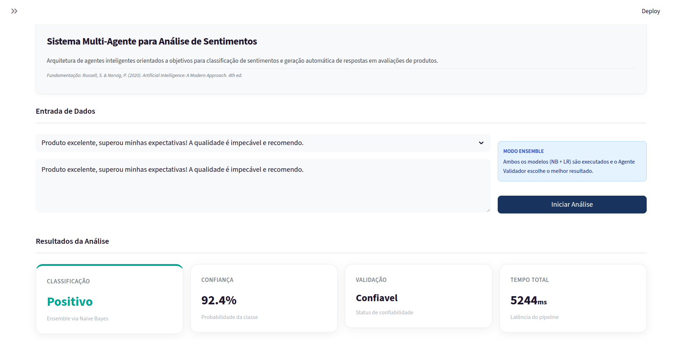

# Sistema Multi-Agente para Análise de Sentimentos

**Disciplina:** Introdução à Inteligência Artificial
**Semestre:** 2025.2
**Professor:** Andre Luis Fonseca Faustino
**Turma:** T03

## Integrantes do Grupo
* Isabela Gomes Mendes (20220038147)
* Matheus Costa Vidal (20220055246)

## Descrição do Projeto

Este projeto implementa um sistema multi-agente de análise automática de sentimentos em avaliações de produtos escritas em português brasileiro. O sistema é baseado na arquitetura PEAS (Performance, Environment, Actuators, Sensors) de agentes inteligentes, conforme descrita por Russell & Norvig (2020).

O sistema utiliza técnicas de Processamento de Linguagem Natural (PLN) e aprendizado supervisionado (Naive Bayes e Regressão Logística) com representação TF-IDF para classificar sentimentos como positivo, neutro ou negativo. A arquitetura modular é composta por seis agentes especializados: SentimentAgent (classificação), ValidationAgent (quantificação de incerteza), KeywordAgent (extração de termos), ActionAgent (decisão tática), ResponseAgent (geração de resposta via LLM Gemini) e ManagerAgent (orquestração). As tecnologias utilizadas incluem Python, scikit-learn, NLTK, Streamlit e Google Generative AI.

## Guia de Instalação e Execução

### 1. Instalação das Dependências

Certifique-se de ter o **Python 3.8+** instalado. Clone o repositório e instale as bibliotecas listadas no `requirements.txt`:

```bash
git clone https://github.com/matheusvidal21/agente-sentimento-de-avaliacoes.git

cd agente-sentimento-de-avaliacoes

python -m venv .venv

source .venv/bin/activate

pip install -r requirements.txt
```

### 2. Configuração da API do Gemini (Opcional)

Para habilitar a geração de respostas automáticas via LLM, crie um arquivo `.env` na raiz do projeto:

```bash
GEMINI_API_KEY=sua_chave_api_aqui
```

### 3. Treinamento dos Modelos

Antes de executar a aplicação, treine os modelos com o dataset incluído:

```bash
python train.py
```

Este comando irá processar o dataset em `dataset/avaliacoes.csv`, treinar os modelos (Naive Bayes e Regressão Logística), e salvá-los na pasta `models/`. Um relatório completo de treinamento será gerado em `docs/`.

### 4. Como Executar

Execute o comando abaixo no terminal para iniciar o servidor local:

```bash
streamlit run app.py
```

A aplicação estará disponível em http://localhost:8501

## Estrutura dos Arquivos

```
agente-sentimento-de-avaliacoes/
├── app.py                          # Interface web Streamlit
├── train.py                        # Script de treinamento
├── requirements.txt                # Dependências do projeto
├── README.md                       # Documentação
├── dataset/
│   └── avaliacoes.csv             # Dataset com 869 avaliações rotuladas
├── models/                         # Modelos treinados (gerados após train.py)
│   ├── nb_modelo_sentimento.joblib
│   ├── lr_modelo_sentimento.joblib
│   └── vetorizador_tfidf.joblib
├── src/                            # Código-fonte dos módulos
│   ├── pipeline.py                # Orquestração do pipeline de treinamento
│   ├── data_preprocessing.py      # Pré-processamento e vetorização
│   ├── model_training.py          # Treinamento e avaliação
│   ├── model_persistence.py       # Salvamento dos modelos
│   ├── prediction_api.py          # API de inferência
│   └── agents/                    # Sistema multi-agente
│       ├── base_agent.py          # Classe base e protocolo PEAS
│       ├── manager_agent.py       # Orquestrador central
│       ├── sentiment_agent.py     # Classificação de sentimento
│       ├── validation_agent.py    # Quantificação de incerteza
│       ├── explainable_agent.py   # Extração de palavras determinantes para decisão
│       ├── action_agent.py        # Decisão tática
│       └── response_agent.py      # Geração de resposta via LLM
└── docs/                           # Documentação e relatórios
    └── ARQUITETURA_AGENTES_PEAS.md # Especificação detalhada
```

## Resultados e Demonstração

O sistema apresenta as seguintes métricas de desempenho:

- **Naive Bayes**: Acurácia de 93.58% e F1-Score de 93.47%
- **Regressão Logística**: Acurácia de 90.37% e F1-Score de 90.11%

A interface web permite testar avaliações e visualizar:
- Classificação do sentimento (Positivo/Neutro/Negativo)
- Comparação entre modelos NB e LR com arbitragem inteligente
- Métricas de incerteza (confiança, entropia, spread)
- Palavras-chave mais relevantes com heatmap visual
- Ação recomendada baseada em regras de negócio
- Resposta automática personalizada via LLM Gemini



As matrizes de confusão e relatórios detalhados de treinamento são gerados automaticamente na pasta `docs/` após executar `python train.py`.

## Referências

* Russell, S. & Norvig, P. (2020). *Artificial Intelligence: A Modern Approach* (4th ed.). Pearson.
* Wooldridge, M. (2009). *An Introduction to MultiAgent Systems* (2nd ed.). Wiley.
* Pedregosa et al. (2011). Scikit-learn: Machine Learning in Python. JMLR 12, pp. 2825-2830.
* Dataset: Avaliações de produtos em português brasileiro (869 amostras rotuladas)
* Google Generative AI - Gemini 2.0 Flash API
