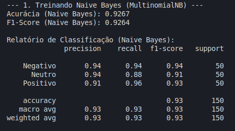
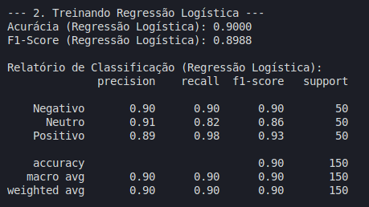

# Análise de Sentimentos sob Incerteza

**Disciplina:** Introdução à Inteligência Artificial  
**Semestre:** 2025.2  
**Professor:** Andre Luis Fonseca Faustino
**Turma:** T03

## Integrantes do Grupo

- Isabela Gomes Mendes (20220038147)
- Matheus Costa Vidal (20220055246)

## Descrição do Projeto

Este projeto implementa um sistema de **análise automática de sentimentos** em avaliações de produtos escritas em português brasileiro. O sistema atua como um **agente probabilístico** que utiliza técnicas de Processamento de Linguagem Natural (PLN) e aprendizado supervisionado (Naive Bayes e Regressão Logística) para inferir o sentimento de uma avaliação como **positivo**, **neutro** ou **negativo**.

A abordagem modela o problema como inferência em ambientes com incerteza, onde o sentimento é um estado não observável que deve ser deduzido a partir de evidências textuais. O sistema inclui uma interface web interativa que permite ao usuário testar avaliações e visualizar não apenas a classificação, mas também as métricas de decisão do agente, como confiança e probabilidades por classe.

## Guia de Instalação e Execução

Siga os passos abaixo para configurar e executar o ambiente do projeto.

### 1. Instalação das Dependências

Certifique-se de ter o **Python 3.8+** instalado. Clone o repositório e instale as bibliotecas listadas no `requirements.txt`:

```bash
# Clone o repositório
git clone https://github.com/matheusvidal21/agente-sentimento-de-avaliacoes.git

# Entre na pasta do projeto
cd sentimento-de-avaliacoes

# Crie e ative um ambiente virtual (Recomendado)
python -m venv .venv
source .venv/bin/activate  # Linux/macOS
# ou .venv\Scripts\activate # Windows

# Instale as dependências
pip install -r requirements.txt
```

### 2. Como Executar

Execute o comando abaixo no terminal para iniciar a interface web:

```bash
streamlit run app.py
```

A aplicação estará disponível no seu navegador em: http://localhost:8501

## Estrutura dos Arquivos

A organização do projeto segue a estrutura abaixo:

- `app.py`: Ponto de entrada da aplicação Web (Streamlit).
- `src/`: Scripts de processamento e lógica do agente.
  - `dataset_generator.py`: Geração de dados sintéticos via Gemini API.
  - `data_preprocessing.py`: Limpeza e vetorização de texto.
  - `model_training.py`: Treinamento dos modelos (Naive Bayes/LR).
  - `prediction_api.py`: API de inferência utilizada pela interface.
- `models/`: Modelos treinados e serializados (.joblib).
- `dataset/`: Dataset de avaliações (`avaliacoes.csv`).
- `docs/`: Imagens e documentação auxiliar.

## Resultados e Demonstração

O sistema apresenta uma acurácia média de **~85%** (Naive Bayes) e **~86%** (Regressão Logística) no conjunto de teste.

Na interface de demonstração, o agente exibe:

1.  **Classificação do Sentimento**: Positivo, Neutro ou Negativo.
2.  **Métricas de Decisão**:
    - **Tempo de Execução**: Custo temporal da inferência.
    - **Confiança**: Grau de certeza na decisão tomada.
    - **Probabilidades Detalhadas**: Visualização da distribuição de probabilidade entre as classes possíveis.

<video width="100%" controls>
  <source src="docs/demo.mp4" type="video/mp4">
  Seu navegador não suporta a tag de vídeo.
</video>

### Métricas de Treinamento

Abaixo, as matrizes de confusão e métricas obtidas durante o treinamento dos modelos:

**Naive Bayes:**



**Regressão Logística:**



## Referências

- **Scikit-learn**: Pedregosa et al., Scikit-learn: Machine Learning in Python, JMLR 12, pp. 2825-2830, 2011.
- **Streamlit**: Framework para criação de web apps de dados.
- **Google Generative AI**: Utilizado para geração de dados sintéticos para treinamento.
- **Naive Bayes & Logistic Regression**: Russell, S. & Norvig, P. (2010). _Artificial Intelligence: A Modern Approach_.
