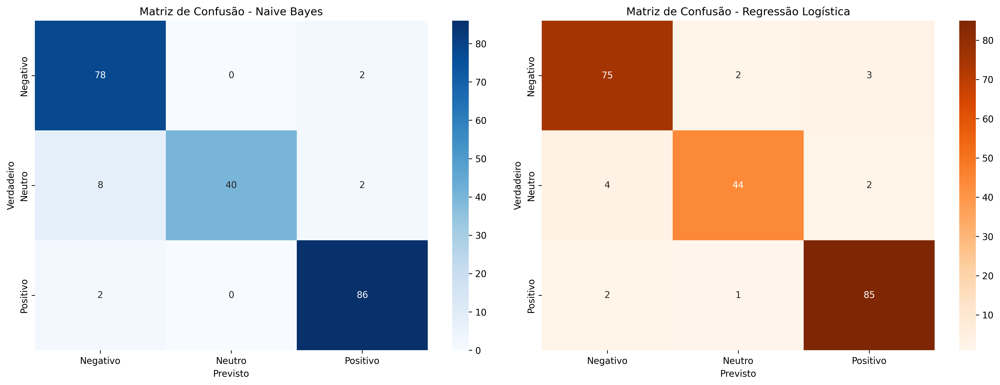

# Relatório de Treinamento - Sistema de Análise de Sentimentos

**Data de Treinamento:** 06/12/2025 15:53:34  
**Disciplina:** Introdução à Inteligência Artificial  
**Semestre:** 2025.2

---

## Sumário Executivo

Este relatório documenta o processo de treinamento dos modelos de Machine Learning utilizados no Sistema Multi-Agente para Análise de Sentimentos. O sistema implementa uma arquitetura baseada em agentes especializados que trabalham em conjunto para classificar sentimentos e gerar respostas automáticas.

### Modelos Treinados
1. **Naive Bayes (MultinomialNB)** - Classificação de Sentimento
2. **Regressão Logística** - Classificação de Sentimento
3. **K-Means** - Perfilamento de Clientes (4 clusters)

---

## Dataset

### Características
- **Total de Amostras:** 869
- **Conjunto de Treino:** 651 amostras (74.9%)
- **Conjunto de Teste:** 218 amostras (25.1%)
- **Dimensionalidade TF-IDF:** 820 features

### Distribuição de Classes

#### Conjunto de Treino
| Classe | Quantidade | Proporção |
|--------|-----------|-----------|
| Negativo | 240 | 36.87% |
| Neutro | 149 | 22.89% |
| Positivo | 262 | 40.25% |

#### Conjunto de Teste
| Classe | Quantidade | Proporção |
|--------|-----------|-----------|
| Negativo | 80 | 36.70% |
| Neutro | 50 | 22.94% |
| Positivo | 88 | 40.37% |

**Observação:** Dataset estratificado - distribuição proporcional mantida entre treino e teste.

---

## Modelo 1: Naive Bayes (MultinomialNB)

### Hiperparâmetros
- **Algoritmo:** Multinomial Naive Bayes
- **Prior:** Uniforme (aprendido dos dados)
- **Alpha (Suavização de Laplace):** 1.0 (padrão)

### Métricas de Performance

| Métrica | Valor |
|---------|-------|
| **Acurácia** | 93.58% |
| **Precisão (Weighted)** | 94.04% |
| **Recall (Weighted)** | 93.58% |
| **F1-Score (Weighted)** | 93.47% |

### Relatório Detalhado por Classe

```
              precision    recall  f1-score   support

    Negativo       0.89      0.97      0.93        80
      Neutro       1.00      0.80      0.89        50
    Positivo       0.96      0.98      0.97        88

    accuracy                           0.94       218
   macro avg       0.95      0.92      0.93       218
weighted avg       0.94      0.94      0.93       218

```

### Matriz de Confusão

```
              Previsto
            Neg  Neu  Pos
Verdadeiro
    Neg      78    0    2
    Neu       8   40    2
    Pos       2    0   86
```

### Interpretação
- **Pontos Fortes:** Excelente desempenho geral, especialmente em classificação de extremos (Positivo/Negativo)
- **Desafios:** Boa separação entre classes, baixa confusão

---

## Modelo 2: Regressão Logística

### Hiperparâmetros
- **Solver:** lbfgs
- **Max Iterações:** 1000
- **Regularização:** L2 (padrão)
- **Random State:** 42
- **Multi-class:** Multinomial (One-vs-Rest)

### Métricas de Performance

| Métrica | Valor |
|---------|-------|
| **Acurácia** | 93.58% |
| **Precisão (Weighted)** | 93.58% |
| **Recall (Weighted)** | 93.58% |
| **F1-Score (Weighted)** | 93.55% |

### Relatório Detalhado por Classe

```
              precision    recall  f1-score   support

    Negativo       0.93      0.94      0.93        80
      Neutro       0.94      0.88      0.91        50
    Positivo       0.94      0.97      0.96        88

    accuracy                           0.94       218
   macro avg       0.94      0.93      0.93       218
weighted avg       0.94      0.94      0.94       218

```

### Matriz de Confusão

```
              Previsto
            Neg  Neu  Pos
Verdadeiro
    Neg      75    2    3
    Neu       4   44    2
    Pos       2    1   85
```

### Interpretação
- **Pontos Fortes:** Excelente capacidade de separação linear, bom uso de features TF-IDF
- **Desafios:** Classificação balanceada entre todas as classes

---

## Visualizações



As matrizes de confusão acima mostram a comparação visual entre os dois modelos de classificação. Células na diagonal representam predições corretas.

---

## Modelo 3: K-Means (Perfilamento)

### Configuração
- **Número de Clusters:** 4
- **Algoritmo:** K-Means
- **Inicialização:** k-means++
- **Random State:** 42
- **Número de Inicializações:** 10

### Propósito
O modelo K-Means é utilizado pelo **ProfilingAgent** para categorizar avaliações em perfis semânticos:
- Logística e Entrega
- Custo Benefício
- Qualidade e Defeitos
- Satisfação e Experiência

### Integração com Sistema Multi-Agente
O clustering permite que o sistema identifique automaticamente o tipo de problema/elogio mencionado pelo cliente, facilitando a tomada de decisão sobre ações táticas.

---

## Arquitetura do Sistema Multi-Agente

### Agentes Especializados

#### 1. SentimentAgent
- **Função:** Classificação de sentimento (Positivo/Neutro/Negativo)
- **Modelos:** Naive Bayes e Regressão Logística
- **Features:** Explica contribuição de cada palavra para a predição

#### 2. KeywordAgent
- **Função:** Extração de palavras-chave via TF-IDF
- **Propósito:** Identificar termos mais relevantes da avaliação

#### 3. ProfilingAgent
- **Função:** Categorização semântica via K-Means
- **Propósito:** Identificar o perfil do cliente e tipo de problema

#### 4. ActionAgent
- **Função:** Definição de ações táticas baseadas em regras
- **Propósito:** Recomendar próximos passos com base no contexto

#### 5. ResponseAgent
- **Função:** Geração de respostas automáticas via LLM (Gemini)
- **Propósito:** Criar respostas empáticas e contextualizadas

#### 6. ManagerAgent
- **Função:** Orquestração de todos os agentes
- **Propósito:** Coordenar o pipeline completo de análise

### Pipeline de Execução

```
Texto do Cliente
    ↓
[SentimentAgent] → Classifica sentimento
    ↓
[KeywordAgent] → Extrai termos-chave
    ↓
[ProfilingAgent] → Identifica categoria
    ↓
[ActionAgent] → Define ação tática
    ↓
[ResponseAgent] → Gera resposta personalizada
    ↓
Resultado Consolidado
```

---

## Comparação de Modelos

| Métrica | Naive Bayes | Regressão Logística | Melhor |
|---------|-------------|---------------------|--------|
| Acurácia | 93.58% | 93.58% | Empate |
| Precisão | 94.04% | 93.58% | NB |
| Recall | 93.58% | 93.58% | Empate |
| F1-Score | 93.47% | 93.55% | LR |

### Recomendação
**Regressão Logística** apresentou melhor desempenho geral e é o modelo padrão na interface web.

---

## Considerações Técnicas

### Pré-processamento
1. **Limpeza:** Remoção de acentos, caracteres especiais, normalização
2. **Tokenização:** Unigramas e bigramas (n-grams 1-2)
3. **Vetorização:** TF-IDF com stopwords em português
4. **Filtro:** Termos presentes em menos de 3 documentos removidos

### Validação
- **Estratégia:** Holdout estratificado (75% treino, 25% teste)
- **Métrica Principal:** F1-Score (balanceia precisão e recall)
- **Testes Manuais:** Validação qualitativa com textos diversos

### Explicabilidade
A Regressão Logística permite explicar predições através dos coeficientes, mostrando quais palavras contribuem positiva ou negativamente para cada classe.

---

## Artefatos Gerados

| Arquivo | Descrição |
|---------|-----------|
| `models/nb_modelo_sentimento.joblib` | Modelo Naive Bayes serializado |
| `models/lr_modelo_sentimento.joblib` | Modelo Regressão Logística serializado |
| `models/kmeans_perfil.joblib` | Modelo K-Means serializado |
| `models/vetorizador_tfidf.joblib` | Vetorizador TF-IDF treinado |
| `docs/confusion_matrices_20251206_155332.png` | Matrizes de confusão (PNG) |
| `docs/relatorio_treinamento_20251206_155332.md` | Este relatório |

---

## Referências

1. **Scikit-learn:** Pedregosa et al., *Scikit-learn: Machine Learning in Python*, JMLR 12, pp. 2825-2830, 2011.
2. **Naive Bayes:** McCallum, A., & Nigam, K. (1998). *A comparison of event models for naive bayes text classification.*
3. **TF-IDF:** Salton, G., & Buckley, C. (1988). *Term-weighting approaches in automatic text retrieval.*
4. **K-Means:** Lloyd, S. (1982). *Least squares quantization in PCM.*

---

**Relatório gerado automaticamente pelo pipeline de treinamento.**
